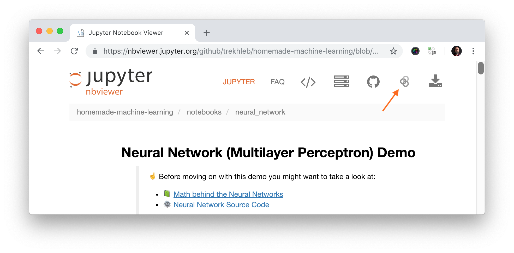

# Machine-Learning-Methods-and-Tools

## Machine Learning Map


## Prerequisites

#### Installing Python

Make sure that you have [Python installed](https://realpython.com/installing-python/) on your machine.

You might want to use [venv](https://docs.python.org/3/library/venv.html) standard Python library
to create virtual environments and have Python, `pip` and all dependent packages to be installed and 
served from the local project directory to avoid messing with system wide packages and their 
versions.

#### Installing Dependencies

Install all dependencies that are required for the project by running:

```bash
pip install -r requirements.txt
```

#### Launching Jupyter Locally

All demos in the project may be run directly in your browser without installing Jupyter locally. But if you want to launch [Jupyter Notebook](http://jupyter.org/) locally you may do it by running the following command from the root folder of the project:

```bash
jupyter notebook
```
After this Jupyter Notebook will be accessible by `http://localhost:8888`.

#### Launching Jupyter Remotely

Each algorithm section contains demo links to [Jupyter NBViewer](http://nbviewer.jupyter.org/). This is fast online previewer for Jupyter notebooks where you may see demo code, charts and data right in your browser without installing anything locally. In case if you want to _change_ the code and _experiment_ with demo notebook you need to launch the notebook in [Binder](https://mybinder.org/). You may do it by simply clicking the _"Execute on Binder"_ link in top right corner of the NBViewer.



## Machine Learning from scratch
- [Linear Regression- With Gradient Descent](https://youtu.be/pCCUnoes1Po)  
- [Linear Regression- With Normal Equation](https://youtu.be/DQ6xfe75CDk) 
- [Logistic Regression](https://youtu.be/x1ez9vi611I)  
- [Naive Bayes](https://youtu.be/3trW5Lig7BU) 
- [K-nearest neighbors](https://youtu.be/QzAaRuDskyc) 
- [K-mean Clustering](https://youtu.be/W4fSRHeafMo) 
- [Support Vector Machine](https://youtu.be/gBTtR0bs-1k)


